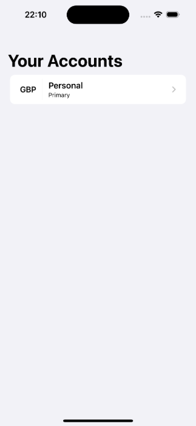
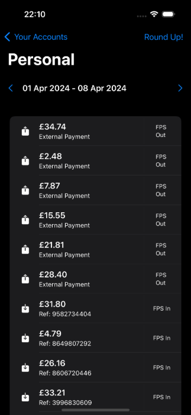
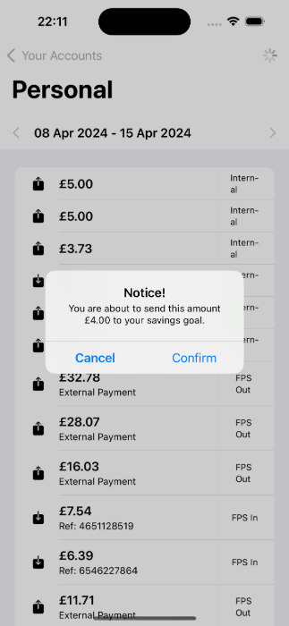

# Starling Bank Engineering Technical Challenge - iOS App (SwiftUI)

This is an iOS application built with Swift and SwiftUI, following the Composable Architecture ([TCA](https://github.com/pointfreeco/swift-composable-architecture)) pattern. The app is designed to provide a "round-up" feature for Starling Bank customers, allowing them to round up their transactions to the nearest pound and transfer the difference to a savings goal.

## Features

The App contains a 3 screens, each with specific function:

- DataLoad/AppRoot: This screen is loaded at app start-up and handles the initial data loading process, ensuring that the user's authentication token is valid and can be used to make API calls. It's designed as the entry point for the user, can be easy expanded to more features such as: force update/device checks etc if needed.
- AccountList: This screen displays a list of the user's accounts retrieved from the Starling Bank API. Users can select an account to view its transaction feed.
- AccountFeed: This screen shows the transaction feed for the selected account. It includes a "Round Up" button, which allows users to round up their transactions for the week and transfer the difference to a savings goal. If the user doesn't have a savings goal set up, the app will guide them through the process of creating one.

Other packages including:

- AuthClient: Dependency that provide authentication information to the rest of the app, at the moment it provide a simple [interface](Sources/AuthClient/AuthClientLive.swift) to provide the access token provided by the Starling Developer Portal.
- ConfigConstant: A module that loads environment specific configs that is bundled with the app (through a plist), such as the APIBaseURl (for sandbox/production/etc.)
- APIClient: API Client that implements URL Requests for the Starling APIs as documented in the [API Reference](https://developer.starlingbank.com/docs#api-reference-1). This package also define all API models and perform conversion to domain models defined in the Models package.
- Models: Package that contains domain models used in the app.
- Utils: Extensions and utilities that are useful throughout the app.

Each feature or screen is separated into its own Swift package, making it easier to maintain, colaborate and extend the codebase.

## Screen shots/Videos:

| Light Theme                                                | Dark Theme                                              | Alert                      |
| ---------------------------------------------------------- | ------------------------------------------------------- | -------------------------- |
| [](Assets/light_small.mp4) | [](Assets/dark_small.mp4) |  |

## Architecture

### Considerations

Several architectural patterns were considered for this project.
Ultimately, the Composable Architecture (TCA) pattern was chosen for the following reasons:

- Separation of Concerns: TCA enforces a strict separation between state management, view rendering, and side effects (e.g., API calls, business logic operations).
- Testability: The architecture is designed with testability in mind, making it easy to write comprehensive unit tests for each component.
- Scalability: As the app grows, TCA's modular design makes it easier to maintain and extend the codebase.
- Familiarity: As an experienced Swift developer, I am already familiar with TCA, which minimizes the learning curve and allows me to deliver the project quickly and to a high standard.

Each feature or screen is separated into its own Swift package, making it easier to maintain and extend the codebase.

## SwiftUI

Instead of using UIKit, this app is built with SwiftUI, Apple's modern declarative UI framework. SwiftUI provides a more efficient and streamlined way to build user interfaces, with a focus on reactive programming and a declarative syntax.

## Testing

The project includes comprehensive unit tests to ensure the reliability and correctness of the codebase. The tests cover various aspects of the app, including data fetching, business logic, and user interface interactions.

## Getting Started

### Prerequisites

- iOS 17.0 or later
- macOS 14.0 or later

1. Clone the repository: git clone https://github.com/Kishimotovn/StarlingTechChallenge.git
2. Open the  in Xcode
3. Require a new access token from the Starling Developer Portal as mentioned here: [Challenge Document](Assets/Starling_Bank_Engineering__Technical_Challenge.pdf)
4. Replace the token in this file: [AuthClientLive](Sources/AuthClient/AuthClientLive.swift)

```swift
import Foundation

public extension AuthClient {
    static var live: AuthClient {
        .init(
            getAccessToken: {
                return "" // <-- Put your new token here
            }
        )
    }
}

```

5. Build and run the app on the desired simulator or device.

## Dependencies

The app only replies on [TCA](https://github.com/pointfreeco/swift-composable-architecture), the rest is implemented using Foundation
SwiftUI: Apple's modern UI framework for building user interfaces.
The dependencies are managed using the Swift Package Manager and are included in the project.

## API Integration

The app integrates with the Starling Bank public developer API to fetch account information, transaction feeds, and manage savings goals. The API calls are made using URLSession, and the responses are parsed and handled accordingly.

## Contributing

Contributions to this project are welcome. If you find any issues or have suggestions for improvements, please open an issue or submit a pull request.

## License

This project is licensed under the MIT License.
